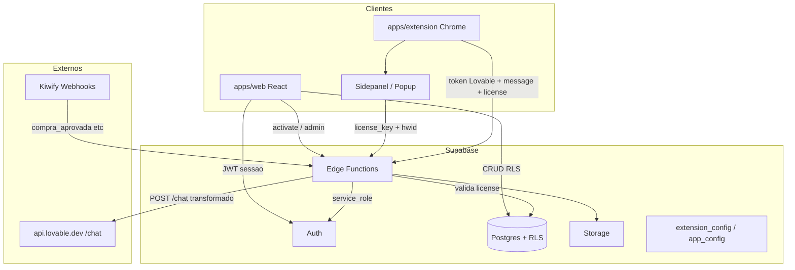
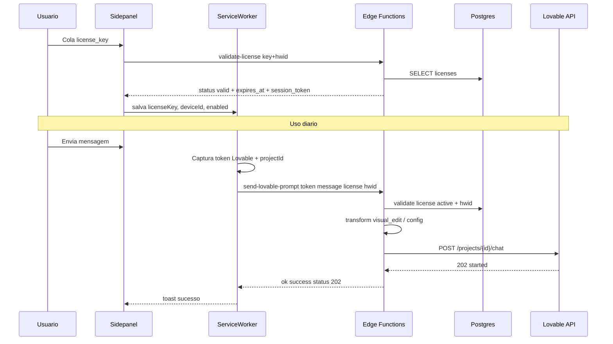

# InfinityLov — Arquitetura Backend, Licença e Extensão

**Versão:** 1.0  
**Data:** 2026-08-05  
**Relacionado:** [SPEC.md](./SPEC.md) · [DESIGN_SYSTEM.md](./DESIGN_SYSTEM.md)

Este documento descreve **como o backend, a licença e a extensão funcionam**, e como o protótipo FastAPI (`license-server` + `lov3.4`) migra para **Supabase Edge Functions**.

---

## 1. Visão geral



**Princípio:** a extensão **não** fala com Lovable `/chat` direto no caminho “crédito zero”. Ela envia mensagem + token do usuário + licença para a Edge Function; o servidor valida a licença, aplica o transform (ex. `visual_edit`) e chama a Lovable com o token do usuário.

---

## 2. Protótipo atual → alvo Supabase

| Hoje (`license-server` FastAPI) | Alvo (Supabase) |
|---------------------------------|-----------------|
| `POST /inject-config` | Edge `inject-config` |
| `POST /validate-license-v2` | Edge `validate-license` |
| `POST /send-lovable-prompt` | Edge `send-lovable-prompt` |
| `POST /lov5` (transform/send/upload) | Edge `lov5` (compat) ou fundir em funções dedicadas |
| `POST /storage/upload` | Supabase Storage + Edge signed upload (ou Storage direto com RLS) |
| `POST /admin/licenses` | Web admin + Edge `admin-*` / RPC `security definer` |
| SQLite local | Postgres `licenses`, `subscriptions`, … |
| Tunnel Cloudflare / `:8000` | URL `https://<project>.supabase.co/functions/v1/...` |

A extensão comercial já usava paths estilo `/functions/v1/...` (Supabase). O FastAPI local espelhou esses paths; no alvo voltamos ao **Supabase de verdade**.

---

## 3. Ciclo de vida da licença (runtime)

### 3.1 Estados

| Status | Relógio | Usuário | Extensão |
|--------|---------|---------|----------|
| `unused` | Parado | — | Não autentica |
| `active` | Corre desde `activated_at` | `user_id` bound | OK se `expires_at > now` e HWID ok |
| `expired` | Esgotado | Mantém histórico | Logout forçado |
| `revoked` | — | — | Logout forçado |

### 3.2 Origens (`source`)

1. **`kiwify`** — webhook cria licença já `active` (`duration_days=30`, `activated_at=now`)
2. **`reseller`** — lote `unused`; ativa em `/ativar-licenca` (web)
3. **`admin`** — geração direta (teste ou venda manual)

### 3.3 Binding de dispositivo (HWID)

- Extensão gera `deviceId` estável (armazenado em `chrome.storage`)
- Primeira validação com licença `active` **binda** `hwid` se estiver null
- Validação seguinte: se `hwid` diferente → `device_mismatch` → erro (admin/support resetam)
- Web (área de membros) **não** exige HWID; só a extensão

### 3.4 Polling na extensão

- Alarm a cada ~5 min: chama `validate-license`
- Se inválida/expirada/revogada → limpa storage, desativa features, pede re-login
- Cache local de `expires_at` para UX; **fonte da verdade = Edge + Postgres**

---

## 4. Fluxo da extensão (passo a passo)



### 4.1 Ativação / login na extensão

1. Usuário abre sidepanel InfinityLov
2. Informa `license_key` (obtida na web após ativação ou Kiwify)
3. `POST .../validate-license` com `{ license_key, hwid }`
4. Se `valid` → grava settings; opcionalmente `inject-config` para baixar flags (`intent`, `transform_mode`, features)
5. Se a chave ainda é `unused` → extensão **não** ativa conta web; orientar ir a `/ativar-licenca` (MVP: extensão só aceita `active`)

### 4.2 Envio de prompt (caminho principal)

1. Content script / background captura:
   - Bearer token Lovable (webRequest / inject)
   - `projectId` da URL
   - payload nativo parcial (`lastPayload`) quando disponível
2. Sidepanel ou proxy interno dispara `SEND_MESSAGE_PROXY`
3. Background `POST send-lovable-prompt`:

```json
{
  "token": "<lovable_jwt>",
  "projectId": "<uuid>",
  "message": "<texto do usuario>",
  "license_key": "INLO-....",
  "email": "opcional",
  "hwid": "<deviceId>",
  "lastPayload": {},
  "files": [],
  "browser_session_id": "opcional",
  "client_git_sha": "opcional"
}
```

4. Edge:
   - Valida licença (`active`, não expirada, HWID)
   - Carrega `extension_config` (intent / transform_mode)
   - Transforma body (ex. `visual_edit` free-credit path)
   - `POST https://api.lovable.dev/.../chat` com o **token do usuário**
5. Resposta espelhando contrato comercial:

```json
{ "ok": true, "success": true, "status": 202, "data": { "status": "started" } }
```

Erro de licença:

```json
{ "ok": false, "success": false, "error": "license_invalid: ...", "reason": "expired|revoked|device_mismatch|..." }
```

Background trata `license_invalid` com logout forçado.

### 4.3 Transform (crédito zero)

- Config em tabela `app_config` / `extension_config` (migrar de `config.json` do FastAPI)
- Modo atual validado no protótipo: **`visual_edit`** (Fast Visual Edit, `cost_credits: 0`)
- Implementação do transform fica em código compartilhado na Edge (portar `license-server/app/transform.py` → TypeScript Deno na function ou WASM/shared package)
- Alternativas futuras (`security_fix_v2`, etc.) via flag sem redeploy da extensão

### 4.4 Upload de anexos

- Protótipo: `POST /storage/upload` + URL pública
- Alvo: bucket Supabase `extension-uploads` (ou signed URL via Edge `storage-upload`)
- Sempre exige `license_key` válida

### 4.5 Captura de token Lovable

- Permissões: `webRequest`, `webRequestBody`, host `lovable.dev` / `api.lovable.dev`
- Token **nunca** é enviado a terceiros além da nossa Edge Function
- Edge usa o token só para chamar Lovable em nome do usuário; **não** persiste o JWT em disco (log apenas project_id / meta)

---

## 5. Catálogo de Edge Functions

Base URL:

```text
https://<PROJECT_REF>.supabase.co/functions/v1/<nome>
```

A extensão usa `API_BASE` = essa origem + paths abaixo (compat com aliases `/functions/v1/...` já usados no protótipo).

### 5.1 Extensão / licença runtime

| Function | Método | Auth | Responsabilidade |
|----------|--------|------|------------------|
| `validate-license` | POST | anon + body key | Valida key+hwid; retorna status/expires/session_token; bind HWID |
| `inject-config` | POST | anon + key | Valida + devolve `config` + license hash/plan |
| `send-lovable-prompt` | POST | anon + key | Valida + transform + proxy Lovable `/chat` |
| `lov5` | POST | anon + key | Compat: actions transform / send / upload (opcional unificar) |
| `storage-upload` | POST | anon + key | Upload anexo → Storage URL |
| `get-support-info` | GET | público/limitado | WhatsApp / suporte |
| `get-templates` | GET/POST | key | Templates (pode retornar `[]` no MVP) |

### 5.2 Web / negócio

| Function | Método | Auth | Responsabilidade |
|----------|--------|------|------------------|
| `activate-license` | POST | service role interno | unused → active; cria user e-mail/senha; sessão |
| `reseller-generate-licenses` | POST | JWT reseller/admin | Gera lote; debita créditos |
| `kiwify-webhook` | POST | secret Kiwify | Provisiona subscription + license active |
| `admin-reset-device` | POST | JWT admin/support | `hwid = null` |
| `admin-revoke-license` | POST | JWT admin | `status = revoked` |

### 5.3 Headers comuns

- `Authorization: Bearer <SUPABASE_ANON_KEY>` nas functions públicas da extensão (padrão Supabase)
- Body sempre JSON
- CORS liberado para origem da extensão (`chrome-extension://...`) e domínio web
- Rate limit por IP + por `license_key` / `hwid`

---

## 6. Contratos JSON (mínimo)

### 6.1 `validate-license`

**Request**

```json
{ "license_key": "INLO-XXXX-XXXX-XXXX", "hwid": "abc123", "email": "opcional@x.com" }
```

**Response OK**

```json
{
  "status": "valid",
  "session_token": "<hash>",
  "days_remaining": 12,
  "plan": "plan_1",
  "expires_at": "2026-09-01T00:00:00Z"
}
```

**Response inválida** (HTTP 200 com status ≠ valid, compat extensão)

```json
{ "status": "expired", "message": "Licença expirada" }
```

Status possíveis: `valid` | `not_found` | `expired` | `revoked` | `unused` | `device_mismatch` | `inactive`

### 6.2 `inject-config`

**Response**

```json
{
  "config": {
    "version": 5,
    "intent": "visual_edit",
    "transform_mode": "visual_edit",
    "features": { "transform": true }
  },
  "license": {
    "plan": "plan_1",
    "expires_at": "...",
    "license_hash": "..."
  }
}
```

### 6.3 `send-lovable-prompt`

Ver §4.2. Sempre revalidar licença **no servidor** antes do proxy (não confiar no client).

### 6.4 `activate-license` (web)

**Request**

```json
{
  "license_key": "INLO-...",
  "email": "user@mail.com",
  "password": "********"
}
```

**Efeitos**

1. Lock row `unused`
2. `auth.admin.createUser` (ou erro se e-mail já com entitlement)
3. Update license → `active`, `user_id`, `activated_at`, `expires_at`
4. Retorna session tokens Supabase para o front

---

## 7. Onde vive a lógica

| Camada | O quê |
|--------|-------|
| **Postgres** | Fonte da verdade: licenses, subscriptions, hwid, credits |
| **Edge Functions** | Validação, transform, proxy Lovable, webhooks, ativação |
| **RLS** | Web app (membros/admin/reseller) lê/escreve o que a role permite |
| **Extensão** | UI, captura token, HWID, polling; **zero** transform local do chat |
| **VPS** | Só host do React estático; **não** roda o backend de licença |

O FastAPI local (`license-server`) é **descontinuado** após a migração das functions.

---

## 8. Configuração da extensão

`apps/extension/lib/constants.js` (alvo):

```js
export const API_BASE = 'https://<PROJECT_REF>.supabase.co/functions/v1';
export const INJECT_CONFIG_URL = `${API_BASE}/inject-config`;
export const VALIDATE_URL = `${API_BASE}/validate-license`;
export const SEND_PROMPT_URL = `${API_BASE}/send-lovable-prompt`;
export const PROXY_URL = `${API_BASE}/lov5`;
export const STORAGE_UPLOAD_URL = `${API_BASE}/storage-upload`;
```

`manifest.json`:

- `host_permissions`: `https://*.supabase.co/*`, `https://lovable.dev/*`, `https://api.lovable.dev/*`, …
- Nome/ícones: InfinityLov (`brand/`)
- Remover dependência de `127.0.0.1:8000` / tunnel em produção

---

## 9. Segurança específica extensão + Edge

1. **Toda** operação sensível revalida licença no servidor
2. `service_role` só dentro das Edge Functions
3. Não logar `token` Lovable nem senhas
4. HWID binding impede compartilhamento fácil da mesma key
5. Revogação/expiry propagam via polling ≤ 5 min
6. Transform e proxy isolados na Edge (código da extensão pode vazar; a regra de negócio não)
7. Webhook Kiwify com secret + idempotência em `webhook_events`
8. Advisors Supabase após cada migration

---

## 10. Migração do protótipo (checklist)

- [ ] Portar `validate_key` / bind HWID → SQL + Edge `validate-license`
- [ ] Portar `transform.py` → módulo Deno/TS na Edge
- [ ] Portar `_send_lovable_prompt` → `send-lovable-prompt`
- [ ] Portar `inject-config` + tabela `extension_config`
- [ ] Apontar `apps/extension` constants para Supabase
- [ ] Testar ativação web → key `active` → login extensão
- [ ] Desligar Docker `license-server` e tunnels
- [ ] Documentar `PROJECT_REF` e secrets no runbook VPS

---

## 11. Relação com a área de membros

| Ação | Onde |
|------|------|
| Comprar (Kiwify) | Checkout externo → webhook → license `active` + user |
| Ativar chave revenda | Web `/ativar-licenca` → Edge `activate-license` |
| Ver chave / expires / reset HWID | Web `/membros/conta` |
| Usar produto Lovable “ilimitado” | Extensão → Edge → Lovable |
| Gerar chaves | `/revendedor` ou `/admin` → Edge generate |

**Uma licença `active` válida** é o entitlement unificado: libera membros (JWT + checagem subscription/license) e extensão (key + hwid).
