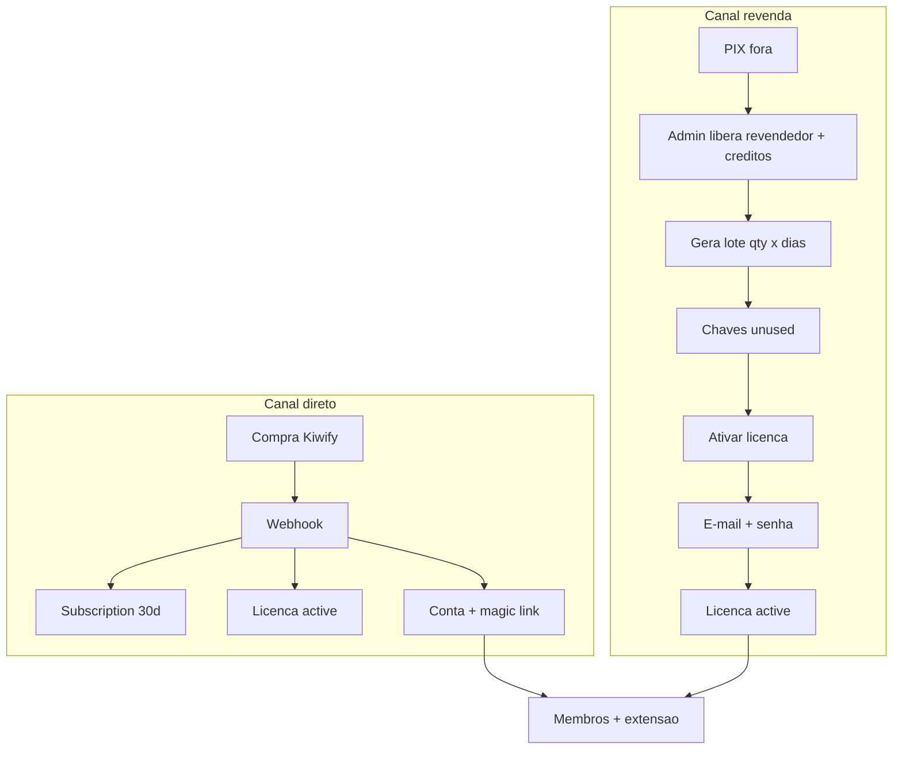
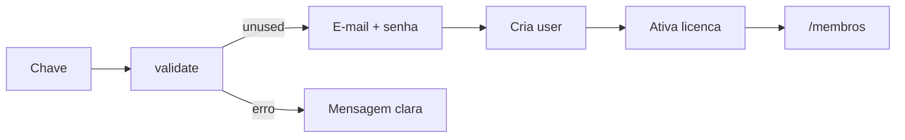
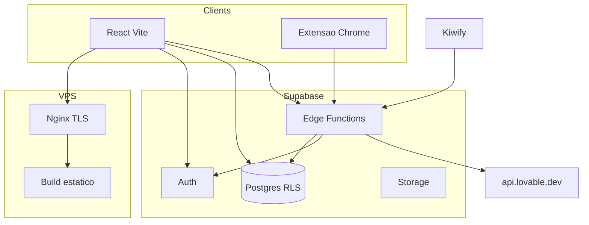

# InfinityLov — Spec da Plataforma

**Versão:** 1.1  
**Data:** 2026-08-05  
**Status:** Formalizado — pronto para implementação (Fase 1)

Documentos irmãos:

- [ARCHITECTURE.md](./ARCHITECTURE.md) — **backend Supabase Edge Functions, ciclo da licença, extensão Chrome**
- [DESIGN_SYSTEM.md](./DESIGN_SYSTEM.md) — UI / tokens InfinityLov

---

## 1. Decisões travadas

| Tema | Decisão |
|------|---------|
| Marca | **InfinityLov** |
| Produto | Conta/licença **única** libera área de membros **e** extensão Chrome |
| Vídeo (MVP) | YouTube / embed |
| Compra direta | Kiwify (webhook) |
| Revenda | PIX **fora** da plataforma + geração de licenças no painel |
| Validade da licença | Relógio inicia **somente na ativação** |
| Auth login | E-mail/senha **ou** fluxo **Ativar licença** → e-mail/senha |
| Backend | **Supabase** — Auth, Postgres, Storage; **toda API de licença/extensão em Edge Functions** (substitui `license-server` FastAPI) |
| Extensão | Chrome MV3; valida licença + envia prompts via Edge; **não** chama Lovable `/chat` no caminho ilimitado |
| Frontend web | React + Vite + TypeScript + Tailwind + shadcn |
| Deploy | VPS (Nginx + build estático do React) + Supabase cloud (backend) |
| UI | Dark-first, tokens em [DESIGN_SYSTEM.md](./DESIGN_SYSTEM.md) |
| Detalhe técnico | [ARCHITECTURE.md](./ARCHITECTURE.md) |

### 1.1 Ainda TBD

- Domínio final e e-mail remetente
- Preço do Plano 1 e `kiwify_product_id`
- Canal de suporte (WhatsApp/e-mail) e textos LGPD
- Aspect ratio oficial do banner vertical de módulo (sugerido **2:3**)
- Quota padrão de créditos por revendedor (admin define manualmente no MVP)

---

## 2. Visão do produto

**InfinityLov** é um SaaS unificado com:

1. **Área de membros** — módulos de conteúdo (aulas + banner vertical por módulo) + hero de marca
2. **Extensão Chrome** — mesma licença valida uso no Lovable
3. **Admin** — conteúdo, planos, assinaturas, licenças, usuários, revendedores
4. **Revendedores** — painel para gerar e gerir lotes de licenças
5. **Checkout dual** — Kiwify (direto) + revenda via PIX externo

Protótipo legado: pasta `lov3.4` / `license-server` (FastAPI local). Será substituído pelas Edge Functions Supabase.

---

## 3. Modelo de negócio

### 3.1 Canal direto (Kiwify)

1. Cliente compra o **Plano 1 — Mensal Ilimitado** na Kiwify
2. Webhook `compra_aprovada` provisiona usuário + subscription 30 dias + licença **já `active`**
3. Envio de magic link (complementar) e/ou acesso via e-mail/senha
4. Renovação: `subscription_renewed` estende `expires_at`
5. Atraso: `subscription_late` → `past_due` + grace de **3 dias**
6. Cancelamento: acesso até o fim do período pago
7. Reembolso / chargeback: revogação imediata

**Entitlement do Plano 1:** todo conteúdo publicado + extensão.

### 3.2 Canal revenda (PIX + licenças)

1. Interessado paga **PIX fora do sistema**
2. Admin promove usuário a `reseller` e atribui **créditos** (quantas chaves pode emitir)
3. Revendedor gera lotes: **quantidade × duração (dias)**
4. Chaves nascem `unused` (tempo **não** corre)
5. Cliente final ativa em `/ativar-licenca`, define e-mail/senha
6. Licença vira `active`; `expires_at = activated_at + duration_days`

PIX **não** tem gateway no MVP — só crédito manual no admin.

### 3.3 Ciclo visual



---

## 4. Licenças — regras nucleares

| Status | Significado |
|--------|-------------|
| `unused` | Gerada; sem usuário; `expires_at` null; **não consome tempo** |
| `active` | Ativada; `activated_at` set; `expires_at = activated_at + duration_days` |
| `expired` | `expires_at < now()` |
| `revoked` | Cancelada (admin; revendedor só se ainda `unused`) |

Regras adicionais:

- 1 licença → 1 usuário
- 1 HWID por licença na extensão (admin/support podem resetar)
- Formato sugerido da chave: `INLO-XXXX-XXXX-XXXX`
- `source`: `kiwify` | `reseller` | `admin`
- Entitlement membros + extensão enquanto `active` e não expirada

---

## 5. Roles (RBAC)

Armazenar em **`auth.users.raw_app_meta_data.role`** (nunca em `user_metadata`). Espelhar em `profiles.role`.

| Role | Poderes |
|------|---------|
| `super_admin` | Tudo (roles, secrets, billing, webhooks) |
| `admin` | Conteúdo, usuários member/support/reseller, assinaturas, licenças, créditos de revendedor |
| `support` | Leitura + reset HWID + reenviar acesso |
| `reseller` | Painel `/revendedor`: gerar/listar lotes dentro dos créditos |
| `member` | `/membros` + extensão se entitlement ativo |

Revendedor pode também ser member (se tiver licença própria ativa).

---

## 6. Auth e login

### 6.1 `/login`

- **Entrar:** e-mail + senha
- **Ativar licença:** CTA → `/ativar-licenca`
- Esqueci a senha (Supabase reset)
- Visual: dark InfinityLov (logo + banner)

### 6.2 `/ativar-licenca`



Regras:

- Chave inválida / já usada / revogada / expirada → erro
- E-mail já com entitlement ativo → rejeitar (“já possui acesso”)
- MVP: login imediato após ativação (sem obrigar confirmação de e-mail)
- Senha mínima: 8 caracteres

---

## 7. Módulo revendedor

### 7.1 Fluxo operacional

1. PIX externo
2. Admin: role `reseller` + créditos
3. Revendedor: CRUD de lotes
4. Cliente: ativação

### 7.2 CRUD gerar licenças

Campos: `quantidade`, `duration_days` (30/60/90…), `label` opcional.

Efeitos:

- Cria `license_batches` + N `licenses` (`unused`)
- Debita N créditos (transação atômica)
- Admin pode gerar sem limite (`source=admin`)

### 7.3 Permissões do revendedor

- Ver apenas lotes/licenças próprios
- Export CSV / copiar chaves
- Revogar só `unused` próprios
- Sem acesso a conteúdo admin, Kiwify ou outros revendedores

---

## 8. Domínio de conteúdo

### 8.1 Módulo

`id`, `title`, `slug`, `description`, `banner_url` (**vertical**), `sort_order`, `published`, timestamps

### 8.2 Aula

`id`, `module_id`, `title`, `slug`, `summary`, `content_type` (`video` \| `text` \| `embed`), `embed_url` / `body_md`, `duration_seconds`, `sort_order`, `published`

MVP: preferir `embed` (YouTube).

### 8.3 Progresso

`lesson_progress(user_id, lesson_id, completed_at, last_position_seconds)`

### 8.4 UX membros

- Hero com banner de marca (`brand/banner-membros.png`)
- Grid de covers verticais dos módulos
- Detalhe → aulas → player embed
- `/membros/conta` — status, `expires_at`, chave, reset HWID

---

## 9. Modelo de dados (schema alvo)

### 9.1 Tabelas principais

- `profiles` — `id` (FK auth.users), `email`, `full_name`, `role`, timestamps
- `plans` — `code`, `name`, `duration_days`, `kiwify_product_id`, `entitlements` (jsonb), `active`
- `subscriptions` — `user_id`, `plan_id`, `status`, `starts_at`, `expires_at`, ids Kiwify
- `resellers` — `user_id`, `credits_remaining`, `credits_lifetime`, `active`, `notes`
- `license_batches` — `reseller_id?`, `created_by`, `quantity`, `duration_days`, `label`
- `licenses` — `key`, `status`, `duration_days`, `activated_at`, `expires_at`, `user_id?`, `batch_id?`, `reseller_id?`, `hwid?`, `source`, `plan_id?`
- `modules`, `lessons`, `lesson_progress`
- `webhook_events` — idempotência (`provider`, `event_id` unique), payload, `processed_at`, `error`

### 9.2 Seed MVP

- Plano `plan_1` — Mensal Ilimitado, 30 dias, `{ "all_content": true, "extension": true }`
- Um `super_admin` (e-mail bootstrap via env)

---

## 10. Arquitetura técnica

> Detalhamento completo de contratos, sequência da extensão e migração do FastAPI: **[ARCHITECTURE.md](./ARCHITECTURE.md)**.



### 10.1 Backend = Supabase Edge Functions

O backend de licença/extensão **não** roda na VPS. A VPS só serve o React.

- Postgres: fonte da verdade (`licenses`, `hwid`, subscriptions, créditos)
- Edge Functions: validação, ativação, transform, proxy Lovable, webhooks Kiwify
- RLS: área web (membros/admin/reseller)
- Legado `license-server/` (FastAPI) → descontinuado após portar as functions

Base URL da extensão:

```text
https://<PROJECT_REF>.supabase.co/functions/v1
```

### 10.2 Como a licença alimenta web + extensão

| Momento | Web | Extensão |
|---------|-----|----------|
| Compra Kiwify | Webhook cria user + license `active` | Usuário cola a mesma key no sidepanel |
| Revenda | `/ativar-licenca` → `unused` vira `active` + e-mail/senha | Depois ativa com a key no sidepanel |
| Uso diário | JWT Supabase + checagem entitlement | `validate-license` + HWID; polling ~5 min |
| Envio prompt | — | `send-lovable-prompt` (Edge valida key, transforma, chama Lovable) |
| Reset dispositivo | `/membros/conta` ou admin | Próximo validate rebinda HWID |

**Regra:** extensão só aceita licença `active` (não `unused`). Ativação de chave revenda é sempre na web primeiro.

### 10.3 Fluxo resumido da extensão

1. Sidepanel: `license_key` + `hwid` → Edge `validate-license` / `inject-config`
2. Background captura token Lovable + `projectId`
3. Mensagem → Edge `send-lovable-prompt` `{ token, projectId, message, license_key, hwid }`
4. Edge: valida licença → aplica `transform_mode` (ex. `visual_edit` 0 crédito) → `POST` Lovable `/chat`
5. Resposta `{ ok, success, status: 202 }` ou `license_invalid` → logout na extensão

Transform e proxy **só no servidor** (código da extensão pode vazar; a regra não).

### 10.4 Catálogo Edge Functions

**Extensão / runtime**

| Function | Papel |
|----------|--------|
| `validate-license` | Key + HWID → valid/expired/revoked/device_mismatch |
| `inject-config` | Config (`intent`, `transform_mode`) + dados da licença |
| `send-lovable-prompt` | Caminho principal de envio (proxy Lovable) |
| `lov5` | Compat transform/send/upload (opcional) |
| `storage-upload` | Anexos → Storage |
| `get-support-info` | Suporte / WhatsApp |

**Web / negócio**

| Function | Papel |
|----------|--------|
| `activate-license` | `unused` → `active` + cria conta e-mail/senha |
| `reseller-generate-licenses` | Lote qty × dias; debita créditos |
| `kiwify-webhook` | Provisiona subscription + license |
| `admin-reset-device` / `admin-revoke-license` | Suporte / admin |

Secrets (`service_role`, token Kiwify) **nunca** no browser nem na extensão empacotada além da `anon` key.

### 10.5 Monorepo

```
infinitylov/
  apps/web/              # React — membros, admin, revendedor, auth
  apps/extension/        # Chrome (migração de lov3.4 → API Supabase)
  packages/ui/
  brand/
  supabase/migrations/
  supabase/functions/    # validate-license, send-lovable-prompt, ...
  docs/SPEC.md
  docs/ARCHITECTURE.md
  docs/DESIGN_SYSTEM.md
```

### 10.6 Rotas web

| Rota | Quem |
|------|------|
| `/` | Landing + CTA Kiwify |
| `/login` | Público |
| `/ativar-licenca` | Público |
| `/auth/callback` | Magic link |
| `/membros/*` | member+ entitlement |
| `/membros/conta` | member (chave, expires, reset HWID) |
| `/revendedor/*` | reseller |
| `/admin/*` | admin+ |

---

## 11. Segurança

- RLS em todas as tabelas `public`
- Roles só em `app_metadata`
- Geração/ativação de licença apenas via Edge Functions
- Reseller isolado aos próprios registros
- Débito de créditos atômico
- Rate limit em validate/activate
- Storage: leitura pública de banners; upload só admin
- Rodar Supabase Advisors após migrations

---

## 12. Fases de entrega

| Fase | Escopo |
|------|--------|
| **1** | Schema + Auth e-mail/senha + shell React + `/login` + `/ativar-licenca` + tokens/assets |
| **2** | Admin CRUD módulos/aulas/banner vertical |
| **3** | Área de membros + progresso + conta |
| **4** | Kiwify Plano 1 + webhook |
| **5** | Revendedores (créditos + lotes) |
| **6** | **Edge Functions de extensão** (`validate-license`, `inject-config`, `send-lovable-prompt` + port do transform) + apontar `apps/extension` ao Supabase + rebrand InfinityLov |
| **7** | VPS Nginx/TLS/CI + termos/privacidade + desligar `license-server` |

---

## 13. Fora de escopo (MVP)

- Gateway PIX / split automático
- Multiplanos com entitlements parciais (schema já prepara)
- Multi-HWID / seats empresariais
- Light theme completo
- App mobile nativo
- Comunidade / fórum / certificados

---

## 14. Assets de marca

| Arquivo | Uso |
|---------|-----|
| [`brand/icon.png`](../brand/icon.png) | Favicon, PWA, ícones da extensão |
| [`brand/banner-membros.png`](../brand/banner-membros.png) | Hero `/membros`, sidepanel extensão |
| [`brand/logo.png`](../brand/logo.png) | Header, login, admin, e-mails |

Detalhes visuais: [DESIGN_SYSTEM.md](./DESIGN_SYSTEM.md).
